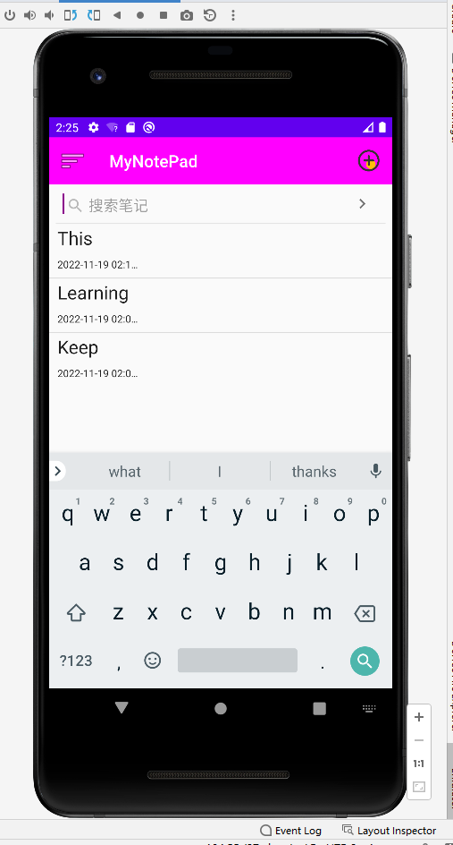

# MyNotePad
## 时间戳
### 代码
（1）在布局noteslist_item文件中增加一个TextView来显示时间戳
```
<TextView
        android:id="@+id/text2"$$
        android:layout_width="match_parent"
        android:layout_height="match_parent"
        android:textAppearance="?android:attr/textAppearanceLarge"
        android:textSize="12dp"
        android:gravity="center_vertical"
        android:paddingLeft="10dip"
        android:singleLine="true"
        android:layout_weight="1"
        android:layout_margin="0dp"
        />
```
（2）数据库中已有文本创建时间和修改时间连个字段，在NodeEditor.java中,找到updateNode()这个函数，选取修改时间这一字段，并将其格式化存入数据库
```
Date nowTime = new Date(System.currentTimeMillis());
SimpleDateFormat sdFormatter = new SimpleDateFormat("yyyy-MM-dd HH:mm:ss");
String retStrFormatNowDate = sdFormatter.format(nowTime);
```
```
values.put(NotePad.Notes.COLUMN_NAME_MODIFICATION_DATE, retStrFormatNowDate);
```
（3）在NoteList.java的PROJECTION数组中增加该字段的描述
```
//The columns needed by the cursor adapter
private static final String[] PROJECTION = new String[] {
            NotePad.Notes._ID, // 0
            NotePad.Notes.COLUMN_NAME_TITLE, // 1
            NotePad.Notes.COLUMN_NAME_MODIFICATION_DATE, //2
    };
```
（4）在NoteList.java中，SimpleCursorAdapter中的参数viewsIDs和dataColumns增加子段描述
```
private String[] dataColumns = { NotePad.Notes.COLUMN_NAME_TITLE ,NotePad.Notes.COLUMN_NAME_MODIFICATION_DATE} ;
private int[] viewIDs = { R.id.text1,R.id.text2 };
```
### 实现效果


## 搜索笔记以title为关键字段
### 代码
（1）在NodeList.java的布局文件中新增SearchView控件（备注：引用的是support.v7的包，如未找到，需在build.gradle(Module.app）中添加依赖
```
<android.support.v7.widget.SearchView
            android:id="@+id/sv"
            android:layout_width="match_parent"
            android:layout_height="wrap_content"
            />
```
（2）在NodeList.java中创建一个函数SeachView，新创建一个Cursor来通过SeacrhView搜索的字段在数据库中进行模糊搜索从而装配数据，并在ListView中即时显示，最后在onCreate()中调用
```
private void SearchView(){
        searchView=findViewById(R.id.sv);
        searchView.onActionViewExpanded();
        searchView.setQueryHint("搜索笔记");
        searchView.setSubmitButtonEnabled(true);
        searchView.setOnQueryTextListener(new SearchView.OnQueryTextListener() {
            @Override
            public boolean onQueryTextSubmit(String s) {
                return false;
            }

            @Override
            public boolean onQueryTextChange(String s) {
                if(!s.equals("")){
                    String selection=NotePad.Notes.COLUMN_NAME_TITLE+" GLOB '*"+s+"*'";
                    updatecursor = getContentResolver().query(
                            getIntent().getData(),            // Use the default content URI for the provider.
                            PROJECTION,                       // Return the note ID and title for each note.
                            selection,                             // No where clause, return all records.
                            null,                             // No where clause, therefore no where column values.
                            NotePad.Notes.DEFAULT_SORT_ORDER  // Use the default sort order.
                    );
                    if(updatecursor.moveToNext())
                        Log.i("daawdwad",selection);
                }
               else {
                    updatecursor = getContentResolver().query(
                            getIntent().getData(),            // Use the default content URI for the provider.
                            PROJECTION,                       // Return the note ID and title for each note.
                            null,                             // No where clause, return all records.
                            null,                             // No where clause, therefore no where column values.
                            NotePad.Notes.DEFAULT_SORT_ORDER  // Use the default sort order.
                    );
                }
                adapter.swapCursor(updatecursor);

               // adapter.notifyDataSetChanged();
                return false;
            }
        });

    }
```
在onCreate()中调用
```
        SearchView();
        searchView.clearFocus();
```

### 实现效果



## 修改背景色及字体颜色
### 代码
（1）在OptionMenu中添加修改颜色这一选项，并划分为两类，修改背景颜色和修改字体颜色
```
<item
        android:title="改变颜色">
        <menu>
            <item
                android:title="改变背景颜色"
                android:id="@+id/background-color">
            </item>
            <item android:id="@+id/text-color"
                android:title="改变字体颜色">
            </item>
        </menu>
</item>
```
（2）在NoteEditor中，采用AlertDialog来实现界面交互效果，新建函数showColor()
```
private void showColor(){
        AlertDialog alertDialog=new AlertDialog.Builder(this).setTitle("请选择颜色").
                setIcon(R.mipmap.ic_launcher).setView(R.layout.color_layout)
                .setPositiveButton("确定", new DialogInterface.OnClickListener() {
                    @Override
                    public void onClick(DialogInterface dialog, int which) {
                        dialog.dismiss();
                    }
                }).create();
        alertDialog.show();
    }
```
（3）新建AlertDialog布局 colo_layout.xml文件
```
<LinearLayout xmlns:android="http://schemas.android.com/apk/res/android"
    android:layout_width="match_parent"
    android:layout_height="match_parent"
    android:orientation="horizontal">
    <Button
        android:id="@+id/orange"
        android:layout_width="wrap_content"
        android:layout_height="match_parent"
        android:background="@color/orange"
        android:layout_weight="1"
        android:onClick="onClick"/>
    <Button
        android:id="@+id/chocolate"
        android:layout_width="wrap_content"
        android:layout_height="match_parent"
        android:background="@color/chocolate"
        android:layout_weight="1"
        android:onClick="onClick"/>
    <Button
        android:id="@+id/aqua"
        android:layout_width="wrap_content"
        android:layout_height="match_parent"
        android:background="@color/aqua"
        android:layout_weight="1"
        android:onClick="onClick"/>
    <Button
        android:id="@+id/gray"
        android:layout_width="wrap_content"
        android:layout_height="match_parent"
        android:background="@color/gray"
        android:layout_weight="1"
        android:onClick="onClick"/>
    <Button
        android:id="@+id/pink"
        android:layout_width="wrap_content"
        android:layout_height="match_parent"
        android:background="@color/colorAccent"
        android:layout_weight="1"
        android:onClick="onClick"/>
    <Button
        android:id="@+id/green"
        android:layout_width="wrap_content"
        android:layout_height="match_parent"
        android:background="@color/green"
        android:layout_weight="1"
        android:onClick="onClick"/>
</LinearLayout>
```
（4）在NoteEditor中添加布局文件按钮的点击事件
```
public void onClick(View v) {
        switch (v.getId()){
            case R.id.orange:
                if(isFlag){
                    mText.setBackgroundColor(Color.parseColor("#FF8C00"));
                    colorBack="#FF8C00";
                }else{
                    mText.setTextColor(Color.parseColor("#FF8C00"));
                    colorText="#FF8C00";
                }
                break;
            case R.id.chocolate:
                if(isFlag){
                    mText.setBackgroundColor(Color.parseColor("#D2691E"));
                    colorBack="#D2691E";
                }else{
                    mText.setTextColor(Color.parseColor("#D2691E"));
                    colorText="#D2691E";
                }
                break;
            case R.id.aqua:
                if(isFlag){
                    mText.setBackgroundColor(Color.parseColor("#00FFFF"));
                    colorBack="#00FFFF";
                }else{
                    mText.setTextColor(Color.parseColor("#00FFFF"));
                    colorText="#00FFFF";
                }
                break;
            case R.id.gray:
                if(isFlag){
                    mText.setBackgroundColor(Color.parseColor("#696969"));
                    colorBack="#696969";
                }else{
                    mText.setTextColor(Color.parseColor("#696969"));
                    colorText="#696969";
                }
                break;
            case R.id.pink:
                if(isFlag){
                    mText.setBackgroundColor(Color.parseColor("#D81B60"));
                    colorBack="#D81B60";
                }else{
                    mText.setTextColor(Color.parseColor("#D81B60"));
                    colorText="#D81B60";
                }
                break;
            case R.id.green:
                if(isFlag){
                    mText.setBackgroundColor(Color.parseColor("#00FF7F"));
                    colorBack="#00FF7F";
                }else{
                    mText.setTextColor(Color.parseColor("#00FF7F"));
                    colorText="#00FF7F";
                }
                break;
        }
    }
```
在onOptionItemSelected（）中添加点击事件
```
case R.id.background_color:
    isFlag=true;
    showColor();
    break;
case R.id.text_color:
    isFlag=false;
    showColor();
    break;
```
（4）点击保存之后将颜色的16进制保存到数据库,也是通过updateNote()函数，具体实现与时间戳功能类似，这里说明一下数据库新增字段的实现

1.在NotePad.java中的内部类Notes添加契约
```
/*
* NoteEditor.java EditText setBackGroundColor
* */
public static final String COLUMN_BACKGROUND_COLOR="bColor";
/*
 * NoteEditor.java EditText setTextColor
 * */
public static final String COLUMN_TEXT_COLOR="tColor";
```
2.在NotePadProvider.java的静态构造块往sNotesProjectionMap添加相应的键值对
```
//Maps "bColor" to "bColor"
sNotesProjectionMap.put(
        NotePad.Notes.COLUMN_BACKGROUND_COLOR,
        NotePad.Notes.COLUMN_BACKGROUND_COLOR
);
//Maps "tColor" to "tColor"
sNotesProjectionMap.put(
        NotePad.Notes.COLUMN_TEXT_COLOR,
        NotePad.Notes.COLUMN_TEXT_COLOR
);
```

### 实现效果
改变背景颜色


改变字体颜色


## 添加标签以将笔记分类
### 代码
（1）在NodeEditor.java布局文件中添加Button控件，点击弹出AlertDialog显示类别选项，设置按钮文本
```
//tag selection defined
private final String items[]={"Default","Travel","Work","Study","Life"};
```
```
public void tagSelect(View v){
        AlertDialog.Builder tagbuilder;
        AlertDialog alertDialog;
        tagbuilder=new AlertDialog.Builder(this);
        tagbuilder.setTitle("Tag Selection:");
        tagbuilder.setIcon(R.mipmap.ic_launcher);

        tagbuilder.setSingleChoiceItems(items, checkItem, new DialogInterface.OnClickListener() {
            @Override
            public void onClick(DialogInterface dialog, int which) {
                checkItem=which;
                button.setText(items[checkItem]);

            }
        });
        tagbuilder.setPositiveButton("确定", new DialogInterface.OnClickListener() {
            @Override
            public void onClick(DialogInterface dialog, int which) {
                dialog.dismiss();
            }
        });
        alertDialog=tagbuilder.create();
        alertDialog.show();
    }
```
（2）点击保存之后会将按钮文本保存到数据库

NotePad.java
```
/*
        * Tag selection corresponding to NoteEditor items[] index
        * */
        public static final String COLUMN_TAG_SELECTION_INDEX="tag";
```
NotePadProvider.java
```
// Maps "tag" to "tag"
        sNotesProjectionMap.put(
                NotePad.Notes.COLUMN_TAG_SELECTION_INDEX,
                NotePad.Notes.COLUMN_TAG_SELECTION_INDEX);
```
NoteEdotor.java的PROJECTION中添加
```
NotePad.Notes.COLUMN_TAG_SELECTION_INDEX,
```

（4）在NoteList.java添加抽屉布局，以显示侧滑菜单栏的效果

1.在AndroidManifest.xml中更改主题，禁用ActionBar，查看引用，在styles.xml中进行修改
```
android:theme="@style/AppTheme"
```
```
style name="AppTheme" parent="Theme.AppCompat.Light.NoActionBar"
```
2.在布局文件中使用DrawerLayout布局
```
<android.support.v4.widget.DrawerLayout
    xmlns:android="http://schemas.android.com/apk/res/android"
    xmlns:app="http://schemas.android.com/apk/res-auto"
    android:id="@+id/dl"
    android:layout_width="match_parent"
    android:layout_height="match_parent">

    <LinearLayout
        android:layout_width="match_parent"
        android:layout_height="match_parent"
        android:orientation="vertical"
        android:focusableInTouchMode="true"
        android:focusable="true"

       >
        <android.support.v7.widget.Toolbar
            android:id="@+id/tb"
            android:layout_width="match_parent"
            android:layout_height="wrap_content"
            android:background="@color/colorPrimary"
            app:titleTextColor="@color/white"
            app:title="MyNotePad"
            app:navigationIcon="@android:drawable/ic_menu_sort_by_size"
            >

        </android.support.v7.widget.Toolbar>
        <android.support.v7.widget.SearchView
            android:id="@+id/sv"
            android:layout_width="match_parent"
            android:layout_height="wrap_content"
            />
        <android.support.design.widget.CoordinatorLayout
            android:layout_width="wrap_content"
            android:layout_height="wrap_content"
            xmlns:app="http://schemas.android.com/apk/res-auto"
            >
            <ListView
                android:id="@+id/tv"
                android:layout_width="match_parent"
                android:layout_height="match_parent"/>

        </android.support.design.widget.CoordinatorLayout>
    </LinearLayout>
    <android.support.design.widget.NavigationView
        android:id="@+id/nv"
        android:layout_width="wrap_content"
        android:layout_height="match_parent"
        android:fitsSystemWindows="true"
        android:layout_gravity="left"
        app:headerLayout="@layout/nv_header"
        app:menu="@menu/nv_menu"
        >

    </android.support.design.widget.NavigationView>
</android.support.v4.widget.DrawerLayout>
```
3. listview.xml

NavigationView的菜单编写
```
<?xml version="1.0" encoding="utf-8"?>
<menu xmlns:android="http://schemas.android.com/apk/res/android">
    <group>
        <item android:title="NotePad">
            <menu>
                <item
                    android:id="@+id/notepad"
                    android:title="MyNotePad">
                </item>
            </menu>
        </item>
    </group>
    <group>
        <item android:title="tag">
            <menu>
                <item
                    android:id="@+id/travel"
                    android:title="Travel">
                </item>
                <item
                    android:id="@+id/work"
                    android:title="Work">
                </item>
                <item
                    android:id="@+id/study"
                    android:title="Study">
                </item>
                <item
                    android:id="@+id/life"
                    android:title="Life">
                </item>
                <item
                    android:id="@+id/def"
                    android:title="Default">
                </item>
            </menu>
        </item>
    </group>
</menu>
```
（3）编写toolbar的监听事件和NavigationView的监听事件<br>
1.toolbar
```
setSupportActionBar(toolbar);
toolbar.setNavigationOnClickListener(new View.OnClickListener() {
    @Override
    public void onClick(View v) {
        drawerLayout.openDrawer(Gravity.START);// set from left open NavigationView Menu
    }
});
```
2.NavigationView
```
//navigation view settings
        navigationView=findViewById(R.id.nv);
        navigationView.setNavigationItemSelectedListener(new NavigationView.OnNavigationItemSelectedListener() {
            @Override
            public boolean onNavigationItemSelected(@NonNull MenuItem menuItem) {
                switch (menuItem.getItemId()){
                    case R.id.notepad:
                        tagCursor = getContentResolver().query(
                                getIntent().getData(),            // Use the default content URI for the provider.
                                PROJECTION,                       // Return the note ID and title for each note.
                                null,                             // No where clause, return all records.
                                null,                             // No where clause, therefore no where column values.
                                NotePad.Notes.DEFAULT_SORT_ORDER  // Use the default sort order.
                        );
                        adapter.swapCursor(tagCursor);
                        toolbar.setTitle("MyNotePad");
                        drawerLayout.closeDrawer(navigationView);
                        break;
                    case R.id.travel:
                        tagSelection=NotePad.Notes.COLUMN_TAG_SELECTION_INDEX+" = 'Travel'";
                        tagCursor = getContentResolver().query(
                                getIntent().getData(),            // Use the default content URI for the provider.
                                PROJECTION,                       // Return the note ID and title for each note.
                                tagSelection,                             // No where clause, return all records.
                                null,                             // No where clause, therefore no where column values.
                                NotePad.Notes.DEFAULT_SORT_ORDER  // Use the default sort order.
                        );
                        adapter.swapCursor(tagCursor);
                        toolbar.setTitle("Travel");
                        drawerLayout.closeDrawer(navigationView);
                        break;
                    case R.id.work:
                        tagSelection=NotePad.Notes.COLUMN_TAG_SELECTION_INDEX+" = 'Work'";
                        tagCursor = getContentResolver().query(
                                getIntent().getData(),            // Use the default content URI for the provider.
                                PROJECTION,                       // Return the note ID and title for each note.
                                tagSelection,                             // No where clause, return all records.
                                null,                             // No where clause, therefore no where column values.
                                NotePad.Notes.DEFAULT_SORT_ORDER  // Use the default sort order.
                        );
                        adapter.swapCursor(tagCursor);
                        toolbar.setTitle("Work");
                        drawerLayout.closeDrawer(navigationView);
                        break;
                    case R.id.study:
                        tagSelection=NotePad.Notes.COLUMN_TAG_SELECTION_INDEX+" = 'Study'";
                        tagCursor = getContentResolver().query(
                                getIntent().getData(),            // Use the default content URI for the provider.
                                PROJECTION,                       // Return the note ID and title for each note.
                                tagSelection,                             // No where clause, return all records.
                                null,                             // No where clause, therefore no where column values.
                                NotePad.Notes.DEFAULT_SORT_ORDER  // Use the default sort order.
                        );
                        adapter.swapCursor(tagCursor);
                        toolbar.setTitle("Study");
                        drawerLayout.closeDrawer(navigationView);
                        break;
                    case R.id.life:
                        tagSelection=NotePad.Notes.COLUMN_TAG_SELECTION_INDEX+" = 'Life'";
                        tagCursor = getContentResolver().query(
                                getIntent().getData(),            // Use the default content URI for the provider.
                                PROJECTION,                       // Return the note ID and title for each note.
                                tagSelection,                             // No where clause, return all records.
                                null,                             // No where clause, therefore no where column values.
                                NotePad.Notes.DEFAULT_SORT_ORDER  // Use the default sort order.
                        );
                        adapter.swapCursor(tagCursor);
                        toolbar.setTitle("Life");
                        drawerLayout.closeDrawer(navigationView);
                        break;
                    case R.id.def:
                        tagSelection=NotePad.Notes.COLUMN_TAG_SELECTION_INDEX+" = 'Default'";
                        tagCursor = getContentResolver().query(
                                getIntent().getData(),            // Use the default content URI for the provider.
                                PROJECTION,                       // Return the note ID and title for each note.
                                tagSelection,                             // No where clause, return all records.
                                null,                             // No where clause, therefore no where column values.
                                NotePad.Notes.DEFAULT_SORT_ORDER  // Use the default sort order.
                        );
                        adapter.swapCursor(tagCursor);
                        toolbar.setTitle("Default");
                        drawerLayout.closeDrawer(navigationView);
                        break;
                }
                return true;
            }
        });
```
### 实现效果


## 美化UI
### 实现效果


